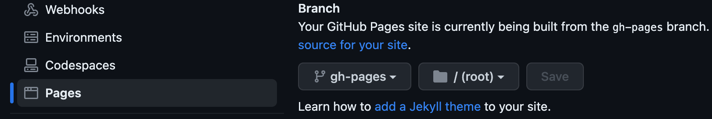
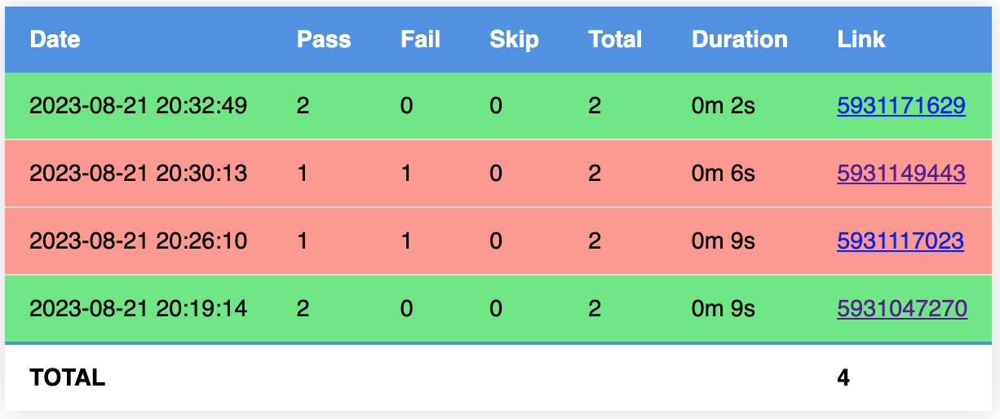
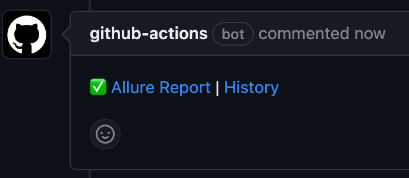
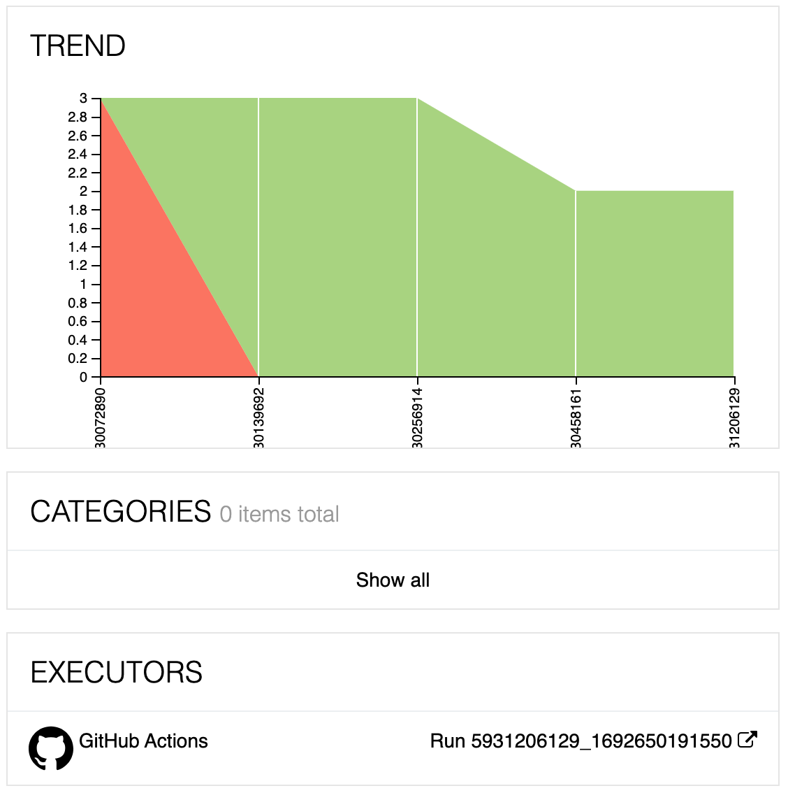

# allure-report-branch-action

Allure Report with history per branch

See examples:

- [Allure History List](https://mgrybyk.github.io/allure-report-branch-action/allure-action/main/self-test/)
- [Allure Report](https://mgrybyk.github.io/allure-report-branch-action/allure-action/main/self-test/5931206129_1692650191550/)
- [Browser different branches](https://mgrybyk.github.io/allure-report-branch-action/allure-action/)
- [Pull Request Comment Example](https://github.com/mgrybyk/allure-report-branch-action/pull/4)

*Compatible with HTML Trend Report Action*

## Usage

1. Enable Pages in your repository settings.


2. In your workflow yaml
```yaml
permissions:
  contents: write

steps:
  - name: Checkout gh-pages
    uses: actions/checkout@v3
    if: always()
    continue-on-error: true
    with:
      ref: gh-pages # branch name
      path: gh-pages-dir # checkout path

  - name: Allure Report Action
    uses: mgrybyk/allure-report-branch-action@v1
    if: always()
    continue-on-error: true
    id: self_test # used in comment to PR
    with:
      report_id: 'self-test'
      gh_pages: 'gh-pages-dir'
      report_dir: 'allure-results'

  - name: Git Commit and Push Action
    uses: mgrybyk/git-commit-pull-push-action@v1
    if: always()
    with:
      repository: gh-pages-dir
      branch: gh-pages
      pull_args: --rebase -X ours
```

### Adding PR Comment

```yaml
permissions:
  # required by https://github.com/thollander/actions-comment-pull-request
  pull-requests: write

steps:
  # After publishing to gh-pages
  - name: Comment PR with Allure Report link
    if: ${{ always() && github.event_name == 'pull_request' && steps.self_test.outputs.report_url }}
    continue-on-error: true
    uses: thollander/actions-comment-pull-request@v2
    with:
      message: |
        ${{ steps.self_test.outputs.test_result_icon }} [Allure Report](${{ steps.self_test.outputs.report_url }}) | [History](${{ steps.self_test.outputs.report_history_url }})
      comment_tag: allure_self_test
      mode: recreate
```

### Examples Repos

- https://github.com/mgrybyk/webdriverio-devtools

## Screenshots





## API

Please see [action.yml](./action.yml)

## Troubleshooting

### Issues on push to gh-pages

Log `! [rejected]        HEAD -> gh-pages (non-fast-forward)`

Do not run your workflow concurrently per PR or branch!
```yaml
# Allow only one job per PR or branch
concurrency:
  group: ${{ github.workflow }}-${{ github.head_ref || github.ref }}
  cancel-in-progress: true # true to cancel jobs in progress, set to false otherwise
```  

## Upcoming features

- cleanup old reports
